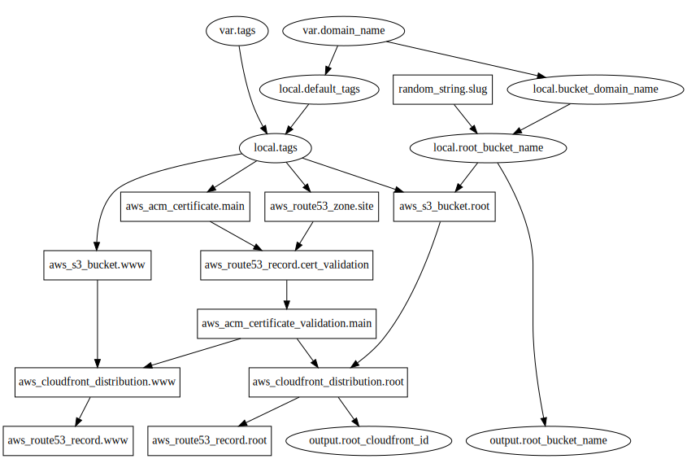

# static-site module

I copied most of this module from [alexhyett/terraform-s3-static-website](https://github.com/alexhyett/terraform-s3-static-website). The differences with this module are:

- I flipped the redirect pattern: www redirects to root instead of the other way around.
- I also switched from email cert validation to DNS cert validation.
- and I removed the TLSv1 and TLSv1.1 policies. These sites require 1.2 or better.

**Note:** when you deploy this for the first time, you will need to copy the NS records from the newly-created Route53 Hosted Zone and paste them into your domain registrar. **This manual step is still required even if the registrar is also Route53.**

Deploying this module gets you:
- a hosted zone to `domain_name`
- certs and records to allow TLSv1.2 traffic to domain_name and www.domain_name
- s3 buckets and cloudfronts to serve content on these websites.
- Traffic to www.domain_name will be redirected to domain_name

Here's a graph of how it breaks down:

After deploying this, sync files to the s3 bucket, then create an invalidation on the cloudfront ID. I believe it's only necessary to do this with the `root` resources, and that you can leave the `www` resources alone.

## Version History

- v0.1.1: Adds an output for the S3 bucket's website endpoint (useful if you
  want to upload site contents and vet it before cutting the DNS over)
- v0.1.0: Initial release
